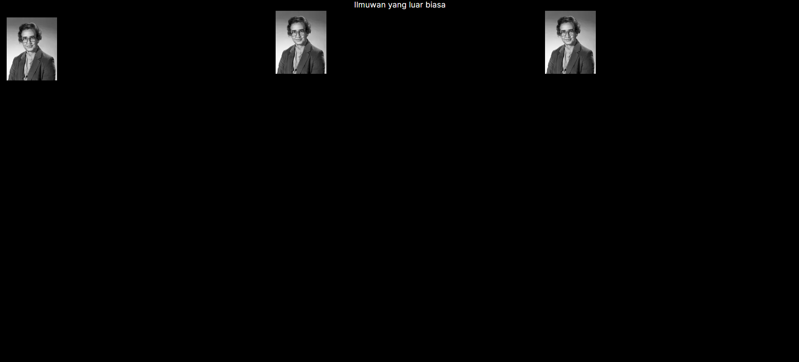
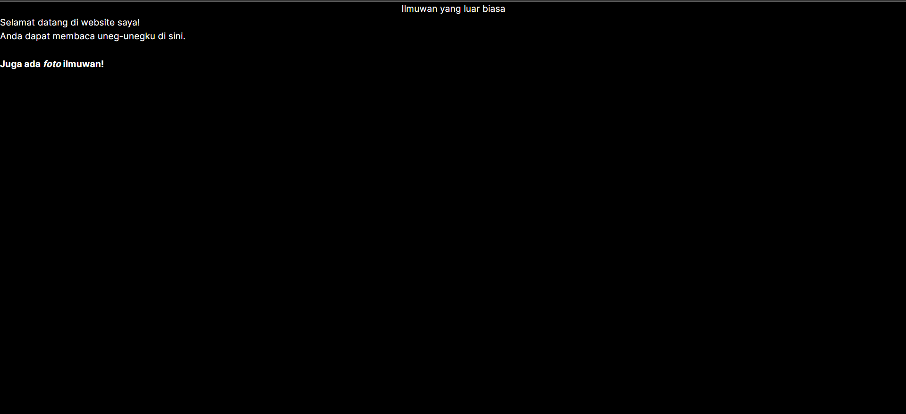
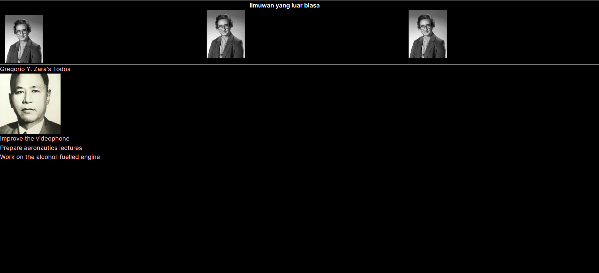
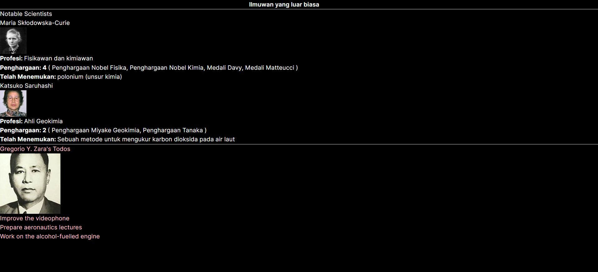
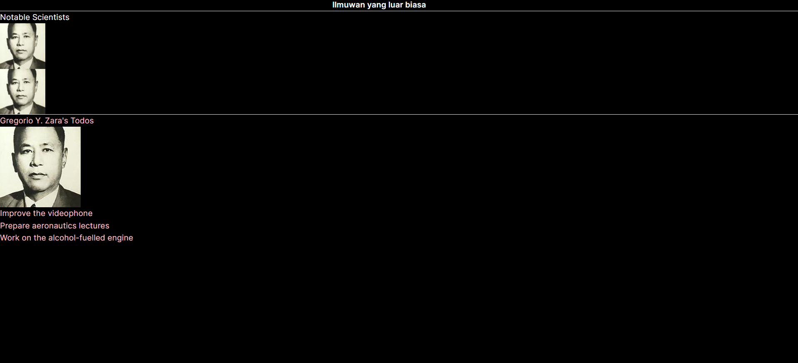
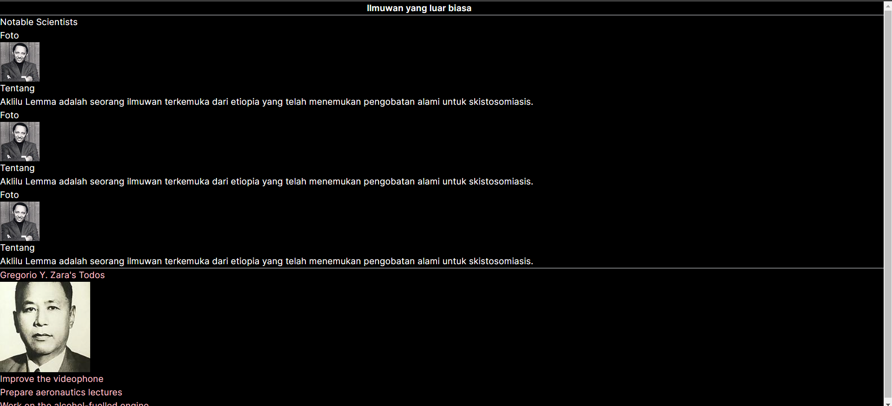

## Laporan Praktikum

|  | Pemrograman Berbasis Framework 2024 |
|--|--|
| NIM |  2141720080 |
| Nama |  Muhammad Haikal Buldan |
| Kelas | TI - 3A |

### Jawaban Soal 1

Hal yang telah saya pelajari adalah:

- Penting untuk memasukkan ketinggian dan lebar ketika menggunakan gambar remote dengan URL sebagai sumber. Ini membantu menentukan proporsi gambar.
- Untuk menggunakan gambar remote dengan aman dan mengizinkan optimisasi gambar, perlu melakukan penyesuaian pada file next.config.js atau next.config.mjs dengan menambahkan domain gambar yang akan digunakan.

Cara untuk menyelesaikan error:
```typescript
    images: {
        remotePatterns: [
            {
                protocol: 'https',
                hostname: 'i.imgur.com',
                port: '',
            },
        ],
    },
```

Di dalam nextConfig yang berada dalam next.config.mjs

Hasil dari soal 1 adalah sebagai berikut


### Jawaban Soal 2

Saya telah mempelajari bahwa ada dua jenis impor dan ekspor komponen dalam Next.js:

- Ekspor Beri Nama (Named)
- Ekspor Default (Default)

Dalam penggunaan ekspor komponen di Next.js, kita hanya diperbolehkan menggunakan ekspor default satu kali per file, sementara untuk ekspor bernama, kita dapat melakukan ekspor sebanyak yang diperlukan. Kita juga dapat menggabungkan ekspor bernama dan default dalam satu file.

Ketika menggunakan ekspor bernama, saat melakukan impor, nama yang digunakan harus sama dengan nama yang diekspor. Sedangkan untuk ekspor default, kita dapat memberikan nama apa pun saat melakukan impor.

Hasil dari perubahan soal 2:



Terdapat sedikit perbedaan, namun hal ini hanya dikarenakan beda pendekatan layouting, jika pendekatan layouting sama, maka hasil tampilan akan sama.

### Jawaban Soal 3

Hasil dari perubahan soal 3 yang telah diperbaiki:


Berikut yang telah saya pelajari:

- Saat menulis JSX, jika terdapat lebih dari satu elemen yang bersarang, diperlukan sebuah kontainer untuk membungkus elemen tersebut.
- Setiap elemen dalam JSX harus memiliki tag penutup.
- Saat menulis JSX, penggunaan kelas harus diganti dengan `className`.
  
Error yang muncul pada poin ketiga termasuk:
- Ketidakhadiran kontainer yang membungkus elemen-elemen bertumpuk, yang dapat diperbaiki dengan menggunakan fragment.
- Penggunaan `class` yang seharusnya diganti dengan `className`.
- Tag `<br>` yang tidak memiliki tag penutup.
- Penempatan tag penutup `<b>` dan `<i>` yang tidak sesuai dengan struktur yang benar.

### Jawaban Soal 4

Perbaikan untuk nomor 4 dilakukan dengan menambahkan dot/titik diikuti dengan key dari object yang ingin diakses. Dalam soal ini yaitu key name dari object person. Sehingga kode program akan menjadi seperti berikut
```javascript
<h1>{person.name}'s Todos</h1>
```

### Jawaban Soal 5

Hasil dari perubahan soal 5 yang url dari image telah diekstrak:


Tidak ada perbedaan pada tampilan website.


### Jawaban Soal 6

Yang saya pelajari dari soal tersebut adalah, untuk kita dapat mengakses langsung isi dari object dari dalam kurung kurawal dan menggabungkannya.

Berikut adalah hasil dari soal 6:


### Jawaban Soal 7

Yang telah saya pelajari adalah cara menggunakan props, yaitu dengan menambahkan props pada parameter dari komponen yang ingin diakses, kemudian di komponen akan diakses, diberi props dengan nama sesuai dengan komponen. Berikut hasil tampilan dari soal 7:


### Jawaban Soal 8

Yang telah saya pelajari adalah, kita bisa menggunakan ternary operator untuk melakukan pengecekan di dalam komponen jsx. Kemudian saya juga mempelajari cara menghandle props yang dikirim dari komponen lain. Berikut hasil tampilan dari soal 8:


### Jawaban Soal 9

Yang telah saya pelajari adalah, dengan menggunakan children untuk mengirimkan jsx akan membuat semakin mudah dalam membuat komponen yang reusable. Berikut hasil tampilan dari soal 9:
